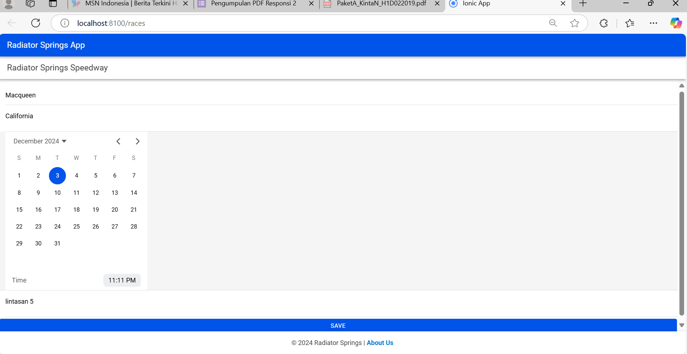

PaketA_ShiftA_H1D022019_KINTAN-KINASIH-MAHAPUTRI

Nama : Kintan Kinasih Mahaputri
NIM : H1D022019
Shift: A

1. CREATE (Membuat Data Baru) 
- Deskripsi:Fungsi ini digunakan untuk menambahkan data baru ke dalam sistem.
- Contoh pada aplikasi :
  - Pengguna mengisi form seperti nama (`Macqueen`), lokasi (`California`), tanggal, waktu, dan lintasan (`lintasan 5`).
  - Saat tombol SAVE diklik, data baru dikirim ke server melalui API/HTTP POST untuk disimpan ke database.
- Teknologi yang Digunakan:
  - API HTTP POST atau GraphQL Mutation.
  - Backend menyimpan data di database (contoh: MySQL, MongoDB).

2. READ (Membaca atau Menampilkan Data)
- Deskripsi: Digunakan untuk mengambil data dari database dan menampilkan kepada pengguna.
- Contoh pada aplikasi :
  - Data seperti nama dan lokasi mungkin diambil dari database dan diisi di form saat aplikasi dibuka.
  - Kalender juga mungkin berisi jadwal balapan yang sudah diambil dari database.
- Teknologi yang Digunakan:
  - API HTTP GET untuk mengambil data dari server.
  - Data ditampilkan di UI menggunakan framework frontend seperti Angular, React, atau Vue.

3. UPDATE (Memperbarui Data yang Ada)  
- Deskripsi:Fungsi ini memperbarui data yang sudah ada di database.
- Contoh pada aplikasi :
  - Pengguna mengedit nama, tanggal, atau waktu balapan, lalu klik SAVE.
  - Sistem mengirimkan data baru ke server menggunakan API HTTP PUT atau PATCH.
- Teknologi yang Digunakan:
  - API HTTP PUT/PATCH dengan payload berisi data yang diperbarui.
  - Backend memperbarui data yang sesuai di database.

4. DELETE (Menghapus Data) 
- Deskripsi: Digunakan untuk menghapus data yang tidak lagi diperlukan.
- Contoh pada aplikasi Anda:
  - Jika ada tombol atau fitur untuk menghapus balapan, saat diklik, data balapan dihapus dari database.
- Teknologi yang Digunakan:
  - API HTTP DELETE yang mengirimkan ID data yang akan dihapus.
  - Backend menghapus data dari database berdasarkan ID tersebut.

Alur CRUD pada Aplikasi 
1. CREATE: Pengguna mengisi form dan menyimpan data balapan baru.
2. READ: Data yang ada ditampilkan saat aplikasi dibuka atau saat kalender digunakan.
3. UPDATE: Data yang sudah ada dapat diedit oleh pengguna melalui form.
4. DELETE: Data balapan tertentu dapat dihapus melalui fitur yang disediakan.

